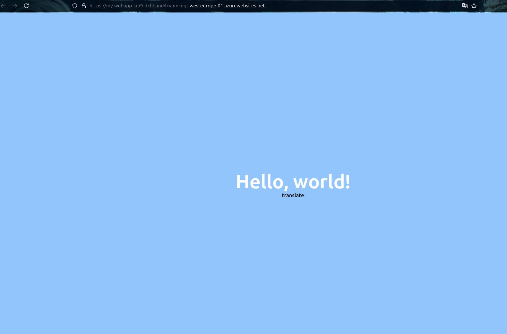

# Практичне заняття №9

### Мета
**Ознайомитися з принципами і практиками неперервної інтеграції, сформувати навички автоматизації CI/CD процесів в GitHub Actions.**

У роботі, для мене найскладніше було зареєструватися в Azure, але це не зайняло в мене багато часу, все інше (додавання ключа в repo і оновлення файлу) пройшло як по маслу.

Фото робочого сервера:

_Код в .github/workflows/first_pipeline.yml_

