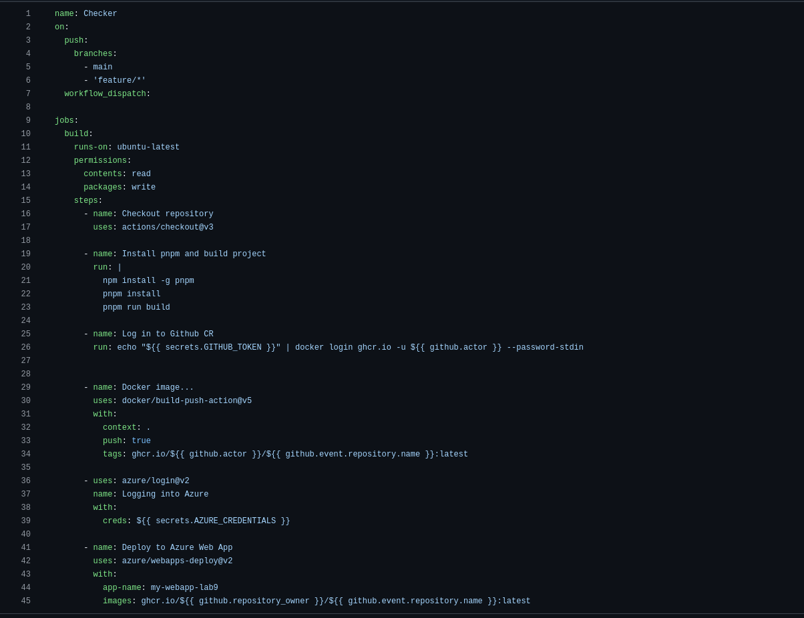

# Практичне заняття №8

### Мета
**Ознайомитися з принципами і практиками неперервної інтеграції, сформувати навички автоматизації CI/CD процесів в GitHub Actions**

### Результат

***У роботі в мене найбільше виникло складнощів у знаходженні та засвоєнні команд GitHun Actions,
а також довелося пройти двічі
[Hello github actions](https://github.com/skills/hello-github-actions?tab=readme-ov-file )
 and [Publish packages](https://github.com/skills/publish-packages) (з першого разу не запам'ятав, що де лежить).З рештою впорався шляхом проб і помилок***

Підтвердження проходження:
 - https://github.com/green680trecker/skills-hello-github-actions
 - https://github.com/green680trecker/skills-publish-packages

Фото pipeline:

_Код в .github/workflows/first_pipeline.yml_

